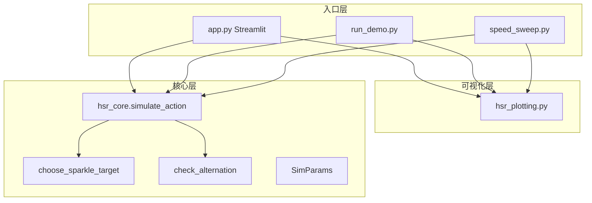
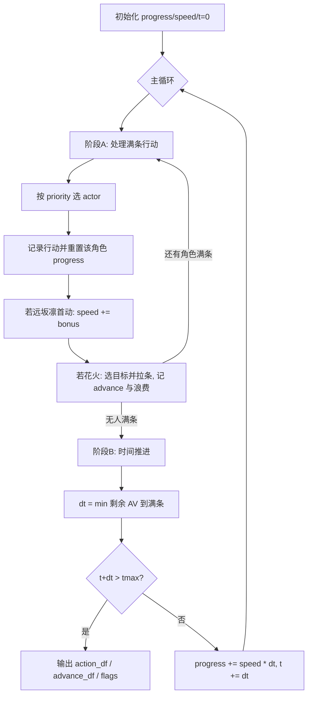

# HSR 行动轴仿真项目 — 框架梳理

## 项目定位

Python 版行动轴仿真（对应原 MATLAB 版本），用于在固定规则下模拟三角色在「行动值（AV）」时间轴上的出手顺序、花火拉条效果，并评估**拉条浪费**与 **Archer/远坂凛是否严格交替**。

---

## 分层架构

| 层级 | 文件 | 职责 |
|------|------|------|
| 核心 | [hsr_core.py](hsr_core.py) | 事件驱动仿真、花火目标策略、交替判定、Excel 导出 |
| 可视化 | [hsr_plotting.py](hsr_plotting.py) | Plotly 合并/分轨行动轴、浪费/交替热力图 |
| 交互 | [app.py](app.py) | 侧边栏调参 + 四 Tab 展示与扫描 |
| 批处理 | [run_demo.py](run_demo.py)、[speed_sweep.py](speed_sweep.py) | 无 UI 的默认参数演示与网格扫描 |

---

## 游戏机制建模（SimParams）

[SimParams](hsr_core.py) 集中定义规则：

- **gauge_max** = 10000：行动条满值
- **tmax**：仿真截止的行动值（如 500）
- **speed0**：三人整数速度 `(花火, Archer, 远坂凛)`
- **sparkle_initial_advance**：花火开局行动条提前比例（默认 40%，即 progress 从 4000 起）
- **sparkle_advance**：花火每次行动后对目标的行动条推进比例（默认 50%）
- **rin_speed_bonus**：远坂凛**第一次**行动后速度 +N（默认 +20）
- **priority**：同 AV 同时满条时的出手顺序，默认 `花火 > Archer > 远坂凛`
- **sparkle_policy**：花火拉条目标选择策略（见下节）

---

## 核心仿真流程（事件驱动）

主循环在 `simulate_action()` 中，逻辑可概括为两阶段交替：

**阶段 A — 行动结算**（`while progress >= gauge_max`）：

1. 按 `priority` 选出当前满条角色
2. 写入 `action_df`（行动值、角色、第几次行动、当时速度、行动条百分比）
3. 该角色 `progress = 0`
4. 远坂凛首动：永久加速
5. 花火行动：`choose_sparkle_target()` 定目标 → 加 `gauge_max * sparkle_advance` → 超出部分记为 **WastePercent**

**阶段 B — 时间推进**：

- `remain_av = (gauge_max - progress) / speed`，取最小值为下一事件间隔 `dt`
- 若 `t + dt > tmax` 则结束仿真
- 否则全体 `progress += speed * dt`，`t += dt`

**后处理**：`check_alternation()` 检查两类「严格交替」：

- **ActualAltOK**：Archer/远坂凛在 `action_df` 中的实际行动序列是否 A-R-A-R…
- **TargetAltOK**：花火在 `advance_df` 中的拉条目标是否交替

---

## 花火拉条策略（可扩展点）

[`choose_sparkle_target()`](hsr_core.py) 是改玩法的核心入口：

| 策略 | 行为 |
|------|------|
| `alternate`（默认） | 按花火行动次数奇偶：奇→Archer，偶→远坂凛 |
| `always_archer` / `always_rin` | 固定拉一人 |
| `min_progress` | 拉行动条进度更低者 |
| `max_remaining_av` | 拉剩余 AV 更大者 |
| `avoid_waste` | 优先避免溢出浪费；平局则按剩余 AV |

---

## 三种使用路径（步骤）

### 1. 交互仿真 — `streamlit run app.py`

1. 侧边栏：总 AV、三人速度、花火/远坂凛规则、拉条策略、竖线错开
2. 调用 `simulate_action()` → 顶部 metrics + 交替提示
3. **Tab1** 合并行动轴 | **Tab2** 分角色轨 | **Tab3** 表格 + Excel 下载
4. **Tab4** 固定花火速度，网格扫描 Archer×远坂凛 → 表格 + 浪费/交替热力图 + Excel

### 2. 静态演示 — `python run_demo.py`

默认 `SimParams` + 速度 `(160, 120, 100)` → 控制台打印 → 输出 HTML 两张图 + `demo_action_result.xlsx`

### 3. 命令行扫描 — `python speed_sweep.py`

花火=160，Archer 100–140 步长 5，远坂凛 90–130 步长 5 → `speed_sweep_result.xlsx` + 两张热力图 HTML

（Tab4 与 `speed_sweep.py` 逻辑同构，参数由 UI 配置。）

---

## 数据产物

| DataFrame | 主要字段 | 用途 |
|-----------|----------|------|
| `action_df` | ActionValue, Character, ActionCount, SpeedAtAction, ProgressAtActionPercent | 行动时间线 |
| `advance_df` | Target, AdvancePercent, WastePercent, IsWasted | 花火每次拉条与浪费 |
| `flags` | ActualAltOK, TargetAltOK, 及调试序列 | 策略/配速是否达成交替 |
| 扫描 `result_df` | vArcher, vRin, WasteTotalPercent, ActualAltOK, … | 热力图与鲁棒性分析 |

---

## 依赖与运行

- **栈**：numpy、pandas、plotly、streamlit、openpyxl（见 [requirements.txt](requirements.txt) / [environment.yml](environment.yml)）
- **扩展建议**：新角色/新 buff → 改 `SimParams` + 仿真循环；新花火 AI → 只改 `choose_sparkle_target`；新图表 → `hsr_plotting.py`；新入口 → 复用 `simulate_action` 即可

---

## 小结

项目采用**单一核心仿真 + 多入口 + 独立绘图**的清晰拆分：所有业务规则收敛在 `hsr_core.simulate_action` 的事件循环里，UI 与批处理只做参数组装与结果展示，便于从 MATLAB 迁移后继续调参、扫速度和改花火策略。
